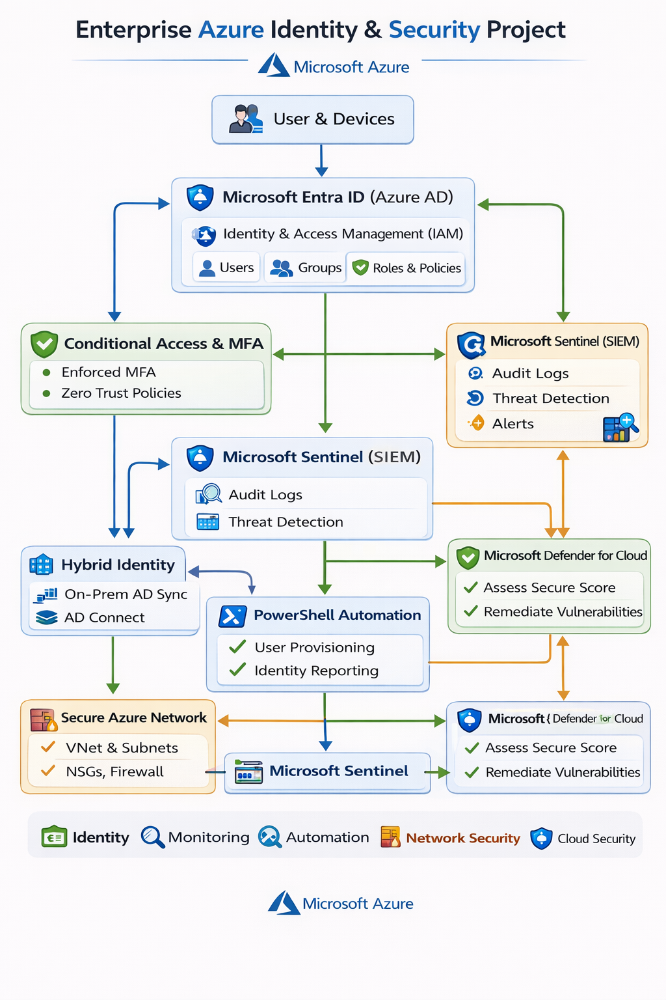
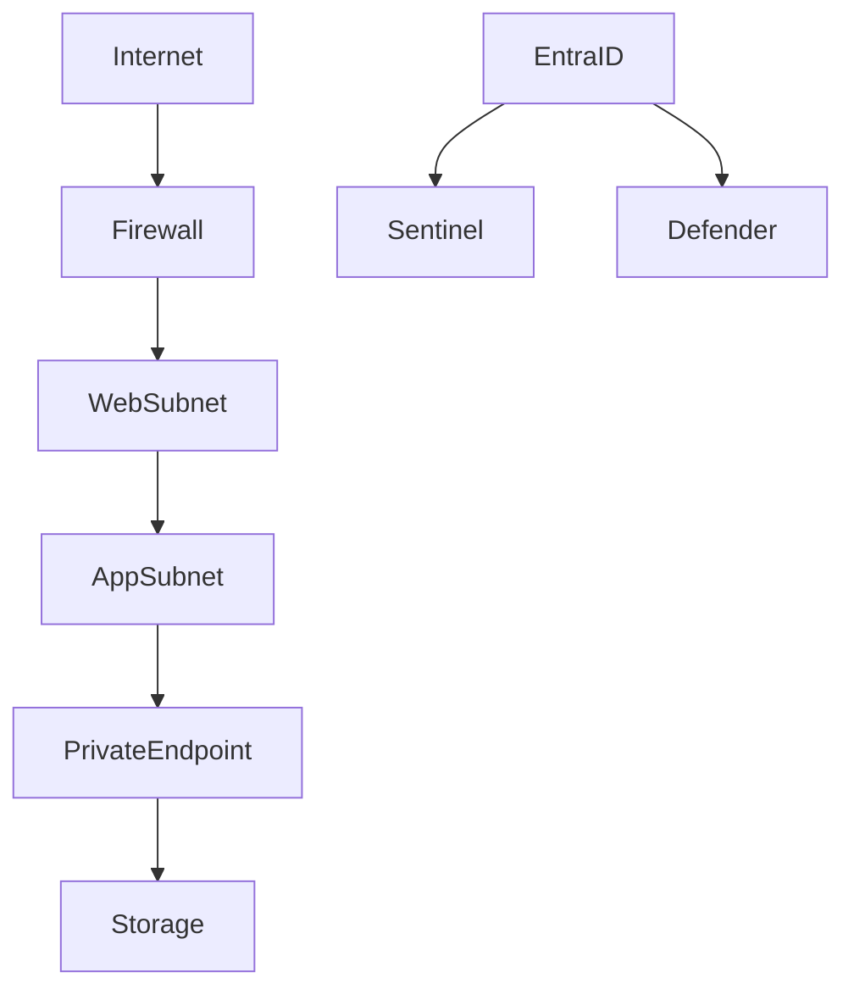

# 🔐 Enterprise Azure Identity & Security Project


## 📌 Overview

This project demonstrates the design and implementation of an enterprise-level cloud identity and security environment using Microsoft Azure. It focuses on Identity and Access Management (IAM), Zero Trust security, SIEM monitoring, automation, and hybrid identity integration.

The goal of this project is to simulate real-world cloud security scenarios and showcase hands-on experience with modern security tools and practices.

---

## 🧠 Skills Demonstrated

- Identity & Access Management (IAM)
- Zero Trust Security (MFA, Conditional Access)
- SIEM Monitoring (Microsoft Sentinel)
- Cloud Security (Microsoft Defender for Cloud)
- Azure Networking (VNets, NSGs, Private Endpoints, Firewall)
- Identity Automation (PowerShell + Microsoft Graph)
- Hybrid Identity (Azure AD Connect)

---

## 🛠️ Technologies Used

- Microsoft Azure  
- Microsoft Entra ID (Azure AD)  
- Microsoft Sentinel (SIEM)  
- Microsoft Defender for Cloud  
- PowerShell  
- Microsoft Graph API  

---

## 🧪 Lab Breakdown

### 🔹 Lab 1 – Entra ID Identity Management
- Created and managed users and roles  
- Implemented identity lifecycle management  
- Monitored identity activity  

---

### 🔹 Lab 2 – Conditional Access & MFA
- Configured Multi-Factor Authentication (MFA)  
- Implemented Conditional Access policies  
- Enforced Zero Trust principles  

---

### 🔹 Lab 3 – Microsoft Sentinel (SIEM)
- Deployed Microsoft Sentinel  
- Monitored authentication activity  
- Created alerts and dashboards  

---

### 🔹 Lab 4 – Identity Automation with PowerShell
- Automated user provisioning  
- Connected to Microsoft Graph  
- Generated identity reports  

---

### 🔹 Lab 5 – Hybrid Identity Integration
- Integrated on-prem AD with Azure AD  
- Configured Azure AD Connect  
- Enabled hybrid authentication  

---

### 🔹 Lab 6 – Azure Network Security
- Designed secure VNet architecture  
- Configured NSGs and Azure Firewall  
- Implemented Private Endpoints  

---

### 🔹 Lab 7 – Microsoft Defender for Cloud
- Enabled Defender for Cloud  
- Assessed Secure Score  
- Remediated vulnerabilities  
- Monitored security alerts  

---

## 📂 Repository Structure

```text
enterprise-azure-identity-security
│
├── labs
│   ├── 01-entra-id-security
│   ├── 02-conditional-access
│   ├── 03-sentinel-monitoring
│   ├── 04-powershell-automation
│   ├── 05-hybrid-identity
│   ├── 06-azure-network-security
│   └── 07-defender-for-cloud
│
├── scripts
│   ├── create-users.ps1
│   ├── disable-inactive-users.ps1
│   └── identity-report.ps1
│
└── screenshots
```

---

## 🏗️ Architecture Diagram





---

## 🔐 Key Security Concepts

- Zero Trust Architecture  
- Least Privilege Access  
- Identity Lifecycle Management  
- Network Segmentation  
- Threat Detection & Monitoring  
- Cloud Security Posture Management  

---

## 🚀 Key Achievements

- Built a complete cloud identity and security environment  
- Implemented IAM and Zero Trust controls  
- Automated identity processes with PowerShell  
- Integrated hybrid identity architecture  
- Designed secure Azure network architecture  
- Improved security posture using Defender for Cloud  

---

## 📸 Screenshots

> Add screenshots here to showcase your work

---

## 👨‍💻 Author

David Ikundji  
Cloud Computing | IAM | Cloud Security  

---

## 📬 Let’s Connect

- LinkedIn: https://www.linkedin.com/in/david-ikundji-5b6473213/ 

---

## ⭐ Final Note

This project reflects hands-on experience in cloud security and identity management. I am actively seeking opportunities in:

Cloud Engineering | IAM | Azure | Security
